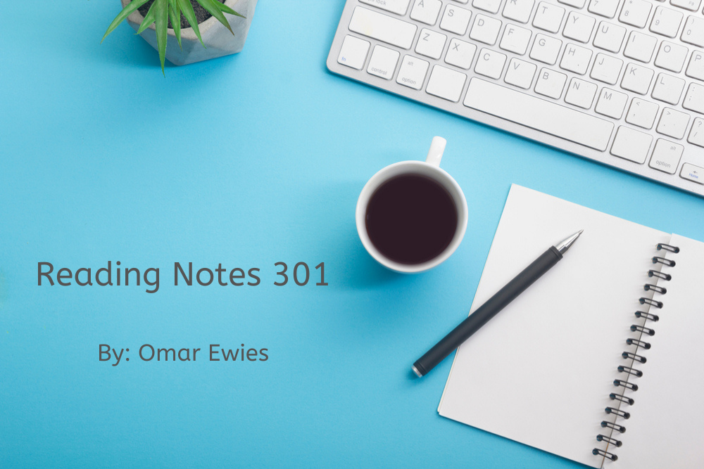

# Code 301 Reading Notes

Here you will find my notes for **Code 301: Intermediate Software Development.**

 Feel free to bookmark this to keep an eye on my Notes updates.

## Table of content

Read Num | Read title | Read link
------------ | ------------- | --------------
01 |  SMACSS and Responsive Web Design | [Click here](https://oebitw.github.io/301-Reading-Notes/read01)
02 |  jQuery, Events, and The DOM | [Click here](https://oebitw.github.io/301-Reading-Notes/read02)
03 |  Flexbox and Templating | [Click here](https://oebitw.github.io/301-Reading-Notes/read03)
04 |  Grid Layout | [Click here](https://oebitw.github.io/301-Reading-Notes/read04)
05 |  Heroku Deployment | [Click here](https://oebitw.github.io/301-Reading-Notes/read05)
06 |  Node, Express, and APIs | [Click here](https://oebitw.github.io/301-Reading-Notes/read06)
07 |  What is REST | [Click here]()
08 |  SQL | [Click here]()
09 |  Refactoring | [Click here]()
10 | Call Stack | [Click here]()
11 | EJS template | [Click here]()
12 | EJS Partials | [Click here]()
13 | SENDING FORM DATA | [Click here]()
14 | DATABASE NORMALIZATION | [Click here]()
15 | DIVERSITY AND INCLUSION | [Click here]()