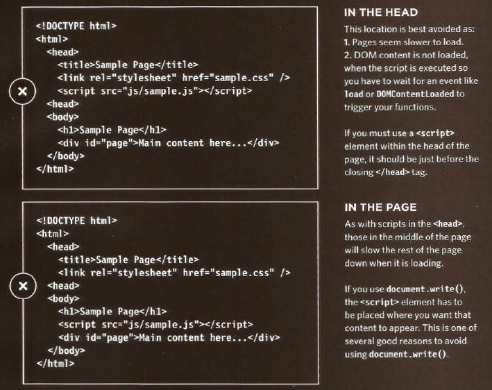
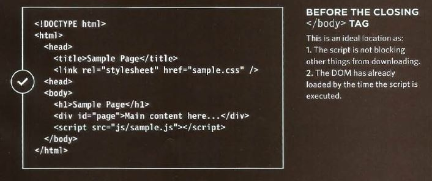

# jQuery, Events, and The DOM


jQuery is a lightweight, "write less, do more", JavaScript library.

The purpose of jQuery is to make it much easier to use JavaScript on your website.

jQuery takes a lot of common tasks that require many lines of JavaScript code to accomplish, and wraps them into methods that you can call with a single line of code.

Many of the biggest companies on the Web use jQuery, such as:

* Google
* Microsoft
* IBM
* Netflix

## Downloading jQuery

There are two versions of jQuery available for downloading:

Production version - this is for your live website because it has been minified and compressed
Development version - this is for testing and development (uncompressed and readable code)

There are three ways to add the jQuery library to the code, two ways are not the best practice and one way is correct as the following images show.





There is a way allows us to have our JavaScript code before the body of our document, in the head section, by using the following code.

```
$(document).ready(function(){

  // jQuery methods go here...

});
```

This is to prevent any jQuery code from running before the document is finished loading (is ready).

It is good practice to wait for the document to be fully loaded and ready before working with it.

## jQuery Syntax

With jQuery you select (query) HTML elements and perform "actions" on them.

Basic syntax is: $(selector).action()

* A $ sign to define/access jQuery.
* A (selector) to "query (or find)" HTML elements.
* A jQuery action() to be performed on the element(s).

Examples:

```

$(this).hide() - hides the current element.

$("p").hide() - hides all <p> elements.

$(".test").hide() - hides all elements with class="test".

$("#test").hide() - hides the element with id="test".

```

## jQuery Selectors

jQuery selectors allow you to select and manipulate HTML element(s).

It's based on the existing CSS Selectors, and in addition, it has some own custom selectors.


### The element Selector

`$("p")`

Example:

```
$(document).ready(function(){
  $("button").click(function(){
    $("p").hide();
  });
});
```

### The #id Selector

`$("#test")`

Example:
```
$(document).ready(function(){
  $("button").click(function(){
    $("#test").hide();
  });
});
```

### The .class Selector


`$(".test")`

Example:

```
$(document).ready(function(){
  $("button").click(function(){
    $(".test").hide();
  });
});
```

## jQuery - Get Content
Three simple, but useful, jQuery methods for DOM manipulation are:

* text() - Sets or returns the text content of selected elements
* html() - Sets or returns the content of selected elements (including HTML markup)
* val() - Sets or returns the value of form fields


## jQuery - Set Content
We can use the same three methods for getting the content to set the content too:

text() - Sets or returns the text content of selected elements
html() - Sets or returns the content of selected elements (including HTML markup)
val() - Sets or returns the value of form fields

## jQuery - Add Elements
* append() - Inserts content at the end of the selected elements
* prepend() - Inserts content at the beginning of the selected elements
* after() - Inserts content after the selected elements
* before() - Inserts content before the selected elements


