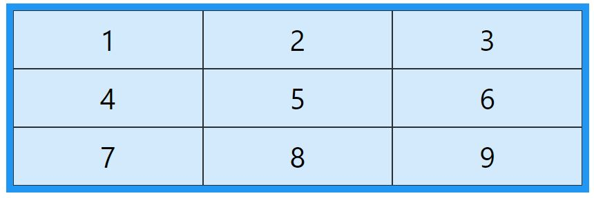

# CSS GRID


The CSS Grid Layout Module offers a grid-based layout system, with rows and columns, making it easier to design web pages without having to use floats and positioning.

A grid layout consists of a parent element, with one or more child elements.

```
<div class="grid-container">
  <div class="grid-item">1</div>
  <div class="grid-item">2</div>
  <div class="grid-item">3</div>
  <div class="grid-item">4</div>
  <div class="grid-item">5</div>
  <div class="grid-item">6</div>
  <div class="grid-item">7</div>
  <div class="grid-item">8</div>
  <div class="grid-item">9</div>
</div>
```



An HTML `element` becomes a grid container when its `display` property is set to `grid`.

```
.grid-container {
  display: grid;
}
```

## Grid Columns


The vertical lines of grid items are called columns.


## Grid Rows


The horizontal lines of grid items are called rows.


## Grid Gaps


The spaces between each column/row are called gaps.

## justify-self

* start – aligns the grid item to be flush with the start edge of the cell.
```
.item-a {
  justify-self: start;
}
```


* end – aligns the grid item to be flush with the end edge of the cell.
```
.item-a {
  justify-self: end;
}
```


* center – aligns the grid item in the center of the cell

```
.item-a {
  justify-self: center;
}
```


* stretch – fills the whole width of the cell (this is the default)

```
.item-a {
  justify-self: stretch;
}
```


## Grid Lines

The lines between columns are called column lines.

The lines between rows are called row lines.


## Grid Properties Overview:

* column-gap: Specifies the gap between the columns.

* gap:	A shorthand property for the row-gap and the column-gap properties.

* grid:	A shorthand property for the grid-template-rows, grid-template-columns, grid-template-areas, grid-auto-rows, grid-auto-columns, and the grid-auto-flow properties.

* grid-area:	Either specifies a name for the grid item, or this property is a shorthand property for the grid-row-start, grid-column-start, grid-row-end, and grid-column-end properties.

* grid-auto-columns:	Specifies a default column size.

* grid-auto-flow:	Specifies how auto-placed items are inserted in the grid.

* grid-auto-rows:	Specifies a default row size.

* grid-column:	A shorthand property for the grid-column-start and the grid-column-end properties

* grid-column-end:	Specifies where to end the grid item

* grid-column-gap:	Specifies the size of the gap between columns

* grid-column-start:	Specifies where to start the grid item

* grid-gap:	A shorthand property for the rid-row-gap and grid-column-gap properties.

* grid-row:	A shorthand property for the grid-row-start and the grid-row-end properties.

* grid-row-end:	Specifies where to end the grid item.

* grid-row-gap:	Specifies the size of the gap between rows. 

* grid-row-start:	Specifies where to start the grid item.
* grid-template: 	A shorthand property for the grid-template-rows, grid-template-columns and grid-areas properties.

* grid-template-areas:	Specifies how to display columns and rows, using named grid items. 

* grid-template-columns:	Specifies the size of the columns, and how many columns in a grid layout. 

* grid-template-rows:	Specifies the size of the rows in a grid layout.

* row-gap:	Specifies the gap between the grid rows.